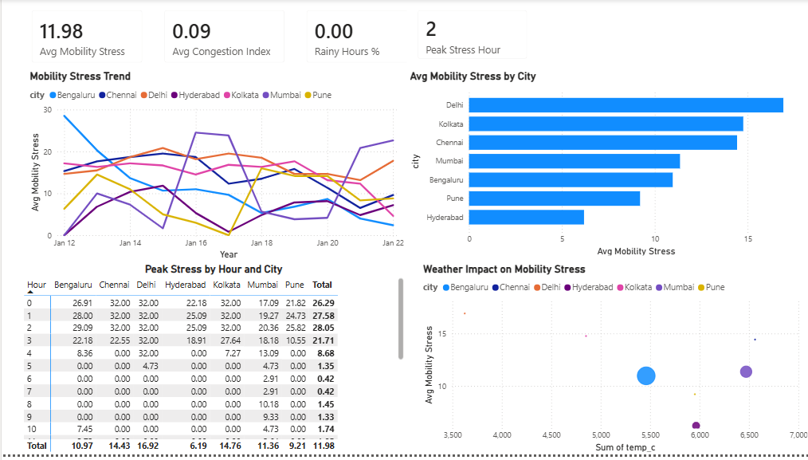

 
# Real-Time Urban Mobility Analytics Platform

## Project Overview
This project is an end-to-end data analytics pipeline that analyzes urban mobility stress across major Indian cities using real-time and historical weather data from a public API.

The platform ingests multi-city data, performs ETL and feature engineering in Python, stores curated fact tables in SQL Server and BigQuery, and visualizes insights using Power BI.

---
## Business Objective
To understand how weather conditions impact urban mobility and traffic congestion across cities, and identify:

- Peak stress hours  
- City-wise congestion patterns  
- Weather impact on mobility  
- Time-based mobility trends  

---
## Architecture

Public API (Open-Meteo)  
→ Python ETL  
→ Raw CSV  
→ Feature Engineering  
→ Parquet Fact Table  
→ SQL Server Warehouse → Power BI  
→ BigQuery (Cloud Warehouse)

---
## Tech Stack 

- Python (pandas, requests, pyarrow)  
- Public API: Open-Meteo  
- SQL Server (local analytics warehouse)  
- BigQuery (cloud analytics warehouse)  
- Power BI  
- DAX (for KPIs)  

---
## Project Structure

```
real_time_mobility_analytics
│
├── README.md
│
├── config
│   └── config.yaml
│
├── data
│   ├── raw
│   │   └── city_conditions.csv
│   └── processed
│       ├── fact_mobility.csv
│       └── fact_mobility.parquet
│
├── scripts
│   ├── fetch_city_conditions.py
│   ├── transform_clean.py
│   ├── load_mssql.py
│   └── load_bigquery.py
│
├── powerbi
│   └── urban_mobility_dashboard.pbix
│
└── sql
    ├── analytics_views.sql
    └── create_tables.sql
```

---
## ETL Pipeline

### Step 1 — API Ingestion
- Fetches hourly historical weather data for 7 Indian cities  
- Uses retry logic and throttling  
- Saves raw data to:

```
data/raw/city_conditions.csv
```

Script used:

```
scripts/fetch_city_conditions.py
```

---
### Step 2 — Feature Engineering
- Creates congestion index  
- Creates mobility stress score  
- Adds binary weather flags (rain, humidity, wind)  
- Outputs analytics-ready fact table  

Outputs:

```
data/processed/fact_mobility.csv  
data/processed/fact_mobility.parquet  
```

Script used:

```
scripts/transform_clean.py
```

---
### Step 3 — Load into SQL Server
- Loads Parquet fact table into SQL Server  
- Creates analytics warehouse table  

Script used:

```
scripts/load_mssql.py
```

SQL schema file:

```
sql/create_tables.sql
```

---
### Step 4 — Analytics Views (SQL)
Creates business-friendly SQL views for BI and analysis:

- City-level KPIs  
- Hourly stress pattern  
- Peak stress hours per city  

SQL file:

```
sql/analytics_views.sql
```

---
### Step 5 — Load into BigQuery (Optional Cloud Layer)
- Loads Parquet fact table into BigQuery  
- Uses Python BigQuery client  

Script used:

```
scripts/load_bigquery.py
```

---
## KPIs

- Avg Mobility Stress  
- Avg Congestion Index  
- Rainy Hours %  
- Peak Stress Hour  

---
## Power BI Dashboard

The Power BI dashboard visualizes:

- City-wise mobility stress comparison  
- Peak traffic hours by city  
- Weather impact on mobility stress  
- Time-series mobility stress trends  

Dashboard file:

```
powerbi/urban_mobility_dashboard.pbix
```

---
## How to Run

Install dependencies:

```bash
pip install pandas requests pyarrow pyodbc google-cloud-bigquery
```

Run the ETL pipeline:

```bash
python scripts/fetch_city_conditions.py
python scripts/transform_clean.py
python scripts/load_mssql.py
```

(Optional) Load into BigQuery:

```bash
python scripts/load_bigquery.py
```

---
## Resume Bullet Points

- Built a multi-city urban mobility analytics pipeline using Python, SQL Server, BigQuery, and Power BI  
- Backfilled 1,800+ historical hourly records from a public weather API  
- Engineered congestion index and mobility stress KPIs using Python and DAX  
- Designed a SQL Server analytics warehouse and BI-ready schema  
- Built interactive Power BI dashboards for peak-hour and weather-impact analysis  

---

##  Dashboard Preview


##  Urban Mobility Dashboard




---
## Author

Matthew Lawrence L
Aspiring Data Analyst \| Data Engineer \| Data Scientist
